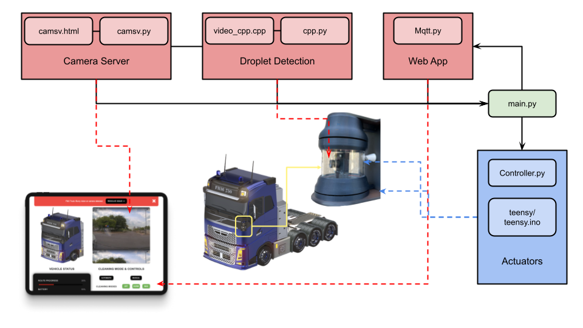

# ME310 Project Repository

Welcome to the ME310-Volvo 2023 Project Repository! 

## Project Diagram

Here is a diagram illustrating the project architecture:

## Overview

The repository contains several key Python and C++ scripts, used for integrating various sub-systems together running on a RaspberryPi. The key sub-systems here are:
- `Teensy/Actuators`
- `MQTT/WebApp`
- `Camera Server + Droplet Detection`

### Key Components

- `main.py`: Starts the main application, takes vaious arguments as inputs, however, defaults are initialsed.
- `Controller.py`: Initialises RaspberryPi GPIOs (for interrupt handling in Teensy), and connects to Teensy via Serial.
- `Mqtt.py`: Handles MQTT messaging for real-time communication with the dynamic Web Application.
- `camsv.html` and `camsv.py`: Hosts a Video Server (for Web Application) and an Image Sever (for Droplet Detection).
- `video_feed.cpp`: A C++ file which uses OpenCV for droplet detection.
- `cpp.py`: Wrapper for running the compiled droplet detection C++ file and communicate with the main application.

### Teensy Folder

The `teensy` folder contains code specifically for the Teensy microcontroller, it handles interrupt on one of the pins used as a "fail-safe" layer, and sends speed command to the two ESCs controlling BLDC motors for blower and visor.
